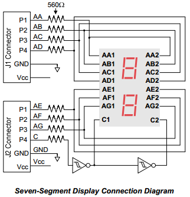
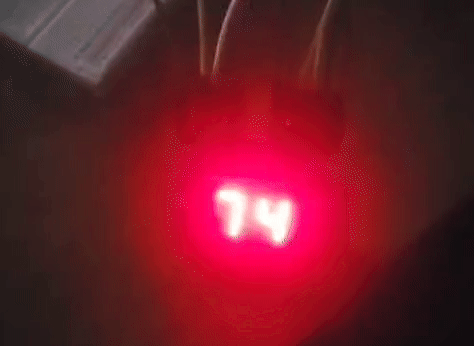
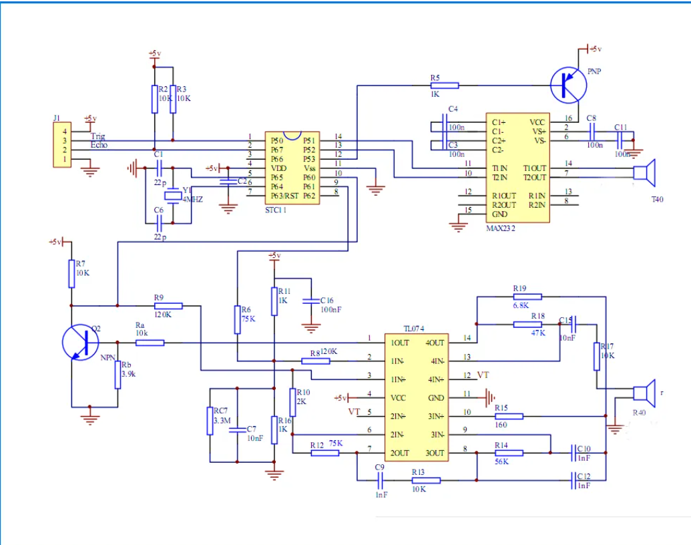
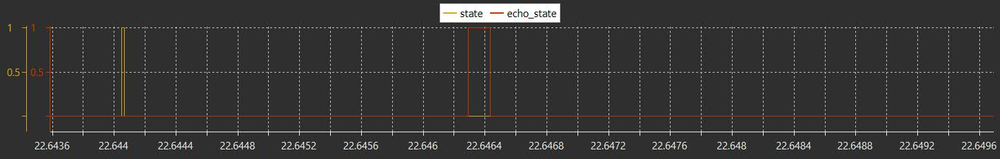
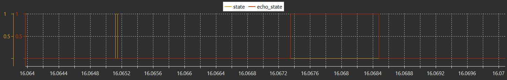

# PROJECTS (STM32)

- **MCU**: STM32  
- **IDE**: STM32CubeIDE  
- **Clock**: Default  
- **Peripherals**: GPIO  

---

## 🔴 LED Blink

Basic LED blink using GPIO + HAL.

### 📈 Graph  

### 🎬 Demo  

---

## 🟡 Button-Led (With / Without Interrupt)

### 📈 Graph - No Interrupt  
  
Had to put some delay for debouncing, it crashes my SWV without...

### 📈 Graph - With Interrupt  
  
Led/Button graphs overlap, no problem with SWV even w/o delays ;]

### 🎬 Demo  

---

## 🔢 7 Segment MUX CTRL

7 Segment Display using GPIO + Timer + Interrupts

### 🧰 Schematic  
  
Common cathode configuration  

- Use Vcc = 3V if possible  
- P4(C) signal chooses between the 7SEG displays  

---

Because only one digit can be lit at a particular time, we need to alternately light up the two digits at least every 20 milliseconds (50 Hz).

###### (For more information and how to implement the 20 ms interrupt check out the code :)

### 🎬 Demo  

---

## 📏 ULTRASONIC DISTANCE SENSOR

**Model**: HC-SR04  
Distance Sensor using GPIO + Input Compare Timer + Interrupts

---

### How does it work?

You have 4 pins:

- **Vcc** – 5V (HC-SR04 uses 5V)  
- **Trig** – Output  
- **Echo** – Input  
- **Ground** – GND

Basically, when the **Trig (Trigger)** pin is set HIGH, it sends out 8 ultrasound pulses at 40 kHz.

> (Documentation said that 10 µs is enough to keep Trig HIGH for it to be registered and to send the waves)

Then, the **Echo** pin listens for the reflected sound waves. If the waves bounce off something and return, the Echo pin goes HIGH for a period that represents the time it took to return.

Knowing that time, and the speed of sound through air, we can calculate the distance:

> Distance = (**Speed of Sound**[air] * **time**) / 2

This project uses **input capture interrupts** on both the rising and falling edges of the Echo signal to measure this time accurately.

---

### 🔍 Examples:

- `state` = TRIG  
- `echo_state` = ECHO  

#### Short distance  

#### Long distance  

As you can see, the TRIG (orange signal) is sent and kept HIGH for 10 µs. If the distance is short, the ECHO (red signal) pulse is short — and vice versa.

### 🎬 Demo  

