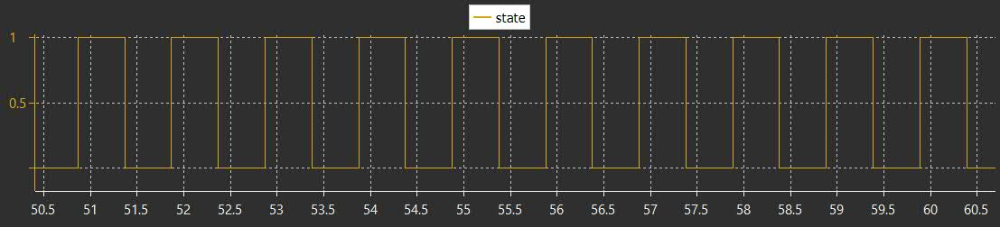
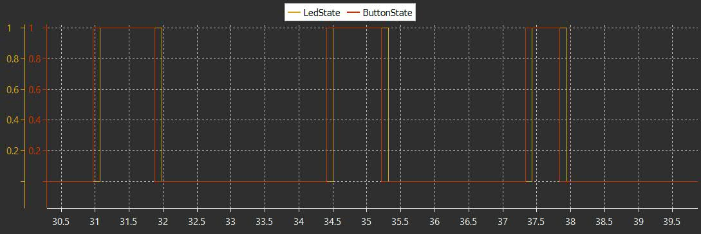
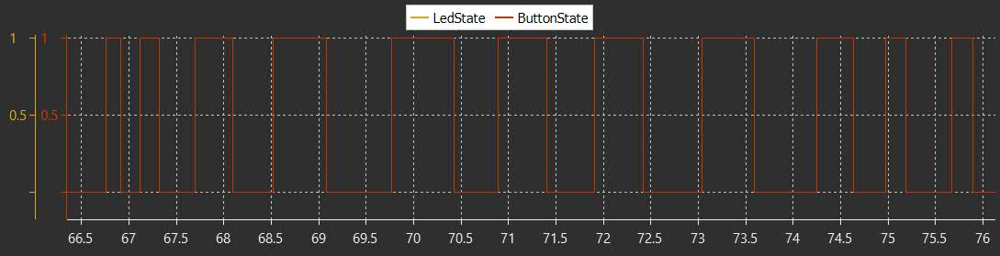
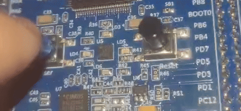

# PROJECTS (STM32)
- MCU: STM32  
- IDE: STM32CubeIDE  
- Clock: Default  
- Peripherals: GPIO
---

## LED Blink

Basic LED blink using GPIO + HAL.

###  Graph  

###  Demo

## Button-Led(W/WO Interrupt)

## Graph No Interrupt

Had to put some delay for debouncing, it crashes my SWV without...

## Graph Interrupt

Led/Button graphs overlap, no problem with SWV even w/o delays ;]

## DEMO

