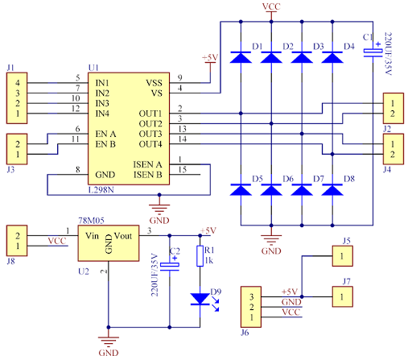
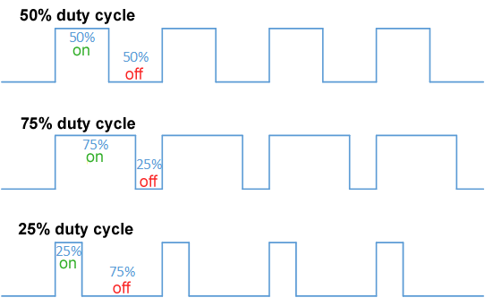
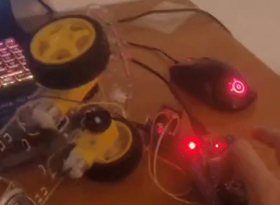

# PROJECTS (STM32)

- **MCU**: STM32  
- **IDE**: STM32CubeIDE  
- **Clock**: Default  
- **Peripherals**: GPIO  

---

## 🔴 LED Blink

Basic LED blink using GPIO + HAL.

### 📈 Graph  

### 🎬 Demo  

---

## 🟡 Button-Led (With / Without Interrupt)

### 📈 Graph - No Interrupt  
  
Had to put some delay for debouncing, it crashes my SWV without...

### 📈 Graph - With Interrupt  
  
Led/Button graphs overlap, no problem with SWV even w/o delays ;]

### 🎬 Demo  

---

## 🔢 7 Segment MUX CTRL

7 Segment Display using GPIO + Timer + Interrupts

### 🧰 Schematic  
  
Common cathode configuration  

- Use Vcc = 3V if possible  
- P4(C) signal chooses between the 7SEG displays  

---

Because only one digit can be lit at a particular time, we need to alternately light up the two digits at least every 20 milliseconds (50 Hz).

###### (For more information and how to implement the 20 ms interrupt check out the code :)

### 🎬 Demo  

---

## 📏 ULTRASONIC DISTANCE SENSOR

**Model**: HC-SR04  
Distance Sensor using GPIO + Input Compare Timer + Interrupts

---

### How does it work?

You have 4 pins:

- **Vcc** – 5V (HC-SR04 uses 5V)  
- **Trig** – Output  
- **Echo** – Input  
- **Ground** – GND

Basically, when the **Trig (Trigger)** pin is set HIGH, it sends out 8 ultrasound pulses at 40 kHz.

> (Documentation said that 10 µs is enough to keep Trig HIGH for it to be registered and to send the waves)

Then, the **Echo** pin listens for the reflected sound waves. If the waves bounce off something and return, the Echo pin goes HIGH for a period that represents the time it took to return.

Knowing that time, and the speed of sound through air, we can calculate the distance:

> Distance = (**Speed of Sound**[air] * **time**) / 2

This project uses **input capture interrupts** on both the rising and falling edges of the Echo signal to measure this time accurately.

---

### 🔍 Examples:

- `state` = TRIG  
- `echo_state` = ECHO  

#### Short distance  

#### Long distance  

As you can see, the TRIG (orange signal) is sent and kept HIGH for 10 µs. If the distance is short, the ECHO (red signal) pulse is short — and vice versa.

### 🎬 Demo  

##  PWM-Control Motors

Basic PWM to run motors, speed and directions.

I used L298N for controlling the motors, changing directions.
### 🧰 Schematic  

---
### How does it work?

You have 4 pins:

- **Vcc(12V+)** – I used 5v because i don t have another power source, that s why i used only 1 motor.
- **GND** – Ground  
- **+5V** – Watch out, this is an output voltage, do not connect this to your board, it will probably fry it...
> Check Diagram above for more information  
- **ENA** – Here you enter the analog signal, i will go in detail below.
- **IN1** - First pin that will change direction, set it to **HIGH** -- forward
- **IN2** - Second pin, set it to **HIGH** -- backwards
> WATCH OUT! Don't set IN1 and IN2 HIGH at the same time, i don t know what will happen, ONLY 1 of them needs to be HIGH;

**IN1** and **IN2** in the L298N use a H Bridge, thats why you can change the direction of the current flow to reverse the motors.

### Implementation
 ---

Well, a PWM(Pulse Width Modulation) is basically a way to control the output voltage by turning off/on the signal(creating a rectangular wave).

#### WaveForm

The duty cycle is how much the signal to be high in a frequency period(T), for example if you have 10V, and want to output 1V, you use 10% duty cycle.

While you may be asking **if i turn the signal off shouldn't the (whatever your using... motor/led, etc..) turn off also?**.

That s what i thought at first but apparently the asnwer is **NOPE**,  because it can’t react fast enough to the on/off transitions, it behaves as if it's receiving a smoother signal (inertia + inductance of the motor help with that).

For this motor control implementation, i've used this parameter:
- **PWM frequency** - 20 **kHz**

Why?? Well because
 - **High frequency** = smoother power(not more __power__ or __torque__)

 - **ON/OFF** happens so fast, the motor's inductance smooths out

 - **Motor** receives a more stable __current__

 - **It feels like it's more powerful**, but really, its just more consistent

 And with frequencies above **20 kHz**, human ears can t hear the buzzing noise the motor makes :)

### 🎬 Demo  

---
